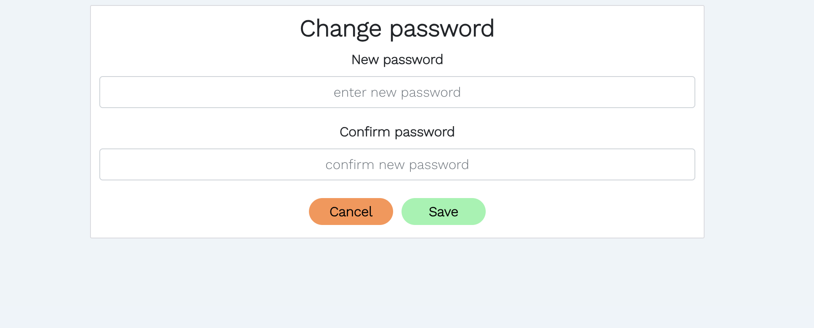
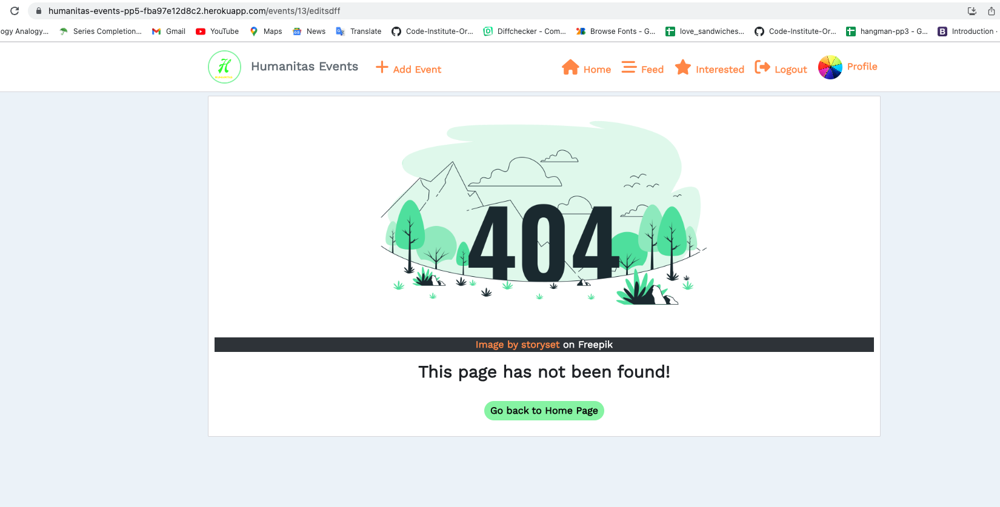
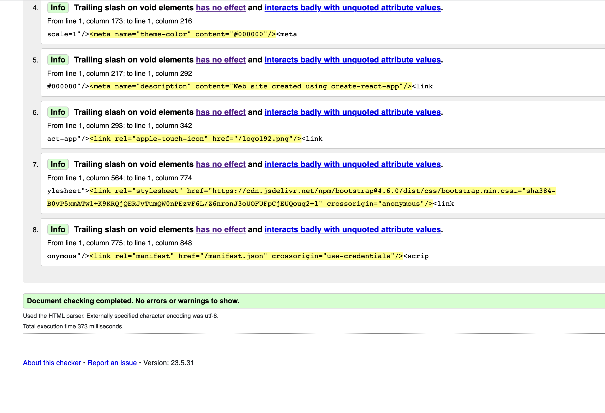

# Humanitas Events

Developer: Shubham Sinha

[View live website](https://humanitas-events-pp5-fba97e12d8c2.herokuapp.com/)

## Table of Contents

0. [About](#about)

1. [Project Goals](#project-goals)

   1. [User Goals](#user-goals)

2. [User Experience](#user-experience)

   1. [Target Audience](#target-audience)
   2. [User Requirements and Expectations](#user-requirements-and-expectations)
   3. [User Stories](#user-stories)
   4. [Site Owner Stories](#site-owner-stories)

3. [Technologies Used](#technologies-used)

   1. [Languages](#languages)
   2. [Libraries, frameworks and dependencies](#libraries-frameworks-and-dependencies)
   3. [Tools & Programs](#tools--programs)

4. [Design](#design)

   1. [Colors](#colours)
   2. [Fonts](#fonts)

5. [Project Structure](#project-structure)

   1. [Front End](#front-end)
   2. [Back End API](#back-end-api)

6. [Features](#features)

   1. [Implemented Features](#implemented-features)
   2. [Features to be Implemented](#features-to-be-implemented)

7. [Validation](#validation)

   1. [CSS](#css)
   2. [Html](#html)
   3. [Lighthouse](#lighthouse)

8. [Deployment](#deployment)

   1. [Deploying in Heroku](#deploying-the-website-in-heroko)
   2. [Forking of Github repo](#forking-the-github-repository)
   3. [Cloning the Github repo](#cloning-the-repository-in-github)

9. [Credits](#credits)

   1. [Image](#images)
   2. [Code](#code)

10. [Thank You](#thank-you)

# About

- Humanitas Events is a platform where organisers can share the events they are organising related to human-rights topics.
- The app is also for people who are looking for the events happening around related to human-rights
- Everyone can show interest in the events, show they are attending, comment and interact with other users
- Users can also follow one another to easily see new events of their favourite organisers

---

## Project Goals

- The goal for this project was to build a platform to enable users to interact with the website in various ways such as commenting on events posted, show interest in an event, show atttending the event or following other's profile. The idea was to keep the portal very simple and for the eductional purpose.

The key functionality aspects:

- simple and intuitive navigation across all pages
- user authentication
- user interaction via events, comments, interested, attending, followers
- user profiles with their description and images
- CRUD functionality for events posted, comments, interested, attending and profile information
- events filtering by title,owner, category and sub_category
- events filtering by interested posts and followed users posts
- responsiveness to allow users use the app on various devices

### User Goals

- Ability to post an event
- Be able to comment on an event
- Ability to amend and update content
- Chance to connect with a variety of interesting individuals.
- Able to show interests in an event
- Able to show attending in an event

## User Experience

### Target Audience

- Users or organisers conducting events related to human rights topic
- Users who want to join an event related to human rights topics

### User Requirements and Expectations

- Application with a clear purpose
- An user-friendly interface that allows quick and efficient navigation
- Responsive and visually good design
- Engaging content within the limits of set categories
- Ways to engage with other users or organisers

### User stories

1. As a site user I can be able to navigate through pages so that I can be able to interact with the app easily
2. As a site user I can sign up as new user so that I can interact with the site comfortably
3. As a site user I can login as existing user so that I can interact with all features in the website
4. As a site user I can logout so that I am sure my data is secured
5. As a site user I can I can see list of events so that that can view all the events happening around
6. As a site user I can see detail page of the Event so that I can read about the Event and comment on it
7. As a site user I can be able to post comments so that I can interact with other users
8. As a site user I can can edit my comments so that I can change what I commented before
9. As a site user I can delete my comments so that I can delete the comments which I don't want to show
10. As a site user I can show interest in an event so that I can be interested in event which I like
11. As a site user I can remove my interests so that I can be remove my interests if not interested anymore
12. As a site user I can add attending to an event so that I can add me in attending list
13. As a site user I can delete my attending so that I can remove my data if not attending event
14. As a site user I can add events so that I can share the events which I am organising
15. As a site user I can edit event which I posted so that I can change the details if required
16. As a site user I can delete event which I posted so that I can remove event if its cancelled
17. As a site user I can view my profile or other's profile so that I can see my or their informations
18. As a site user I can I can edit my profile so that I can change my data or update it
19. As a site user I can change my username so that can decide to change my username as I like
20. As a site user I can change my password so that I can keep updating my password as I wish
21. As a site users I can follow/unfollow other users so that see the events what they posted in my post's feed
22. As a site user I can see what events are upcoming so that I can see the events which are upcoming
23. As a site user I can see who are the top organisers so that I can follow them or see their profiles easily
24. As a site users I can view my avatar or other user's avatar so that I know with whom I am interacting
25. As a site user I can keep scrolling through the page and comments so that they are loaded automatically and I don't have to select next page
26. As a site user I can be inform if my action has been successful so that I can be sure that my data is changed
27. As a site user I can search for events with keywords so that I can find the events I am interested in

### Site Owner Stories

28. As a site owner I can provide full access to logged in user so that they can interact with the pages more independently
29. As a site owner I can restrict the interaction with website so that an unauthorised user cannot make changes in the app
30. As a site owner I can make sure my site is responsive so that user can view the website in all devices without any problem
31. As a site owner I want users to come to a 404 error page so that they don't have to user the browser back button if they enter a URL that does not exist

## Technologies Used

### Languages

- HTML
- CSS
- Javascript
  - React (17.0.2)

### Libraries, frameworks and dependencies

- [Axios](https://axios-http.com/docs/intro) - axios were used for promise-based HTTP. Justification: I used axios to send API requests from the React project to the API and avoid any CORS errors when sending cookies.
- [ClassNames](https://www.npmjs.com/package/classnames/) - JavaScript utility for conditionally joining classNames together, used in the FeedbackMsg component. This is used to apply the styles dynamically based on the type of style and apply more than one style to elements in FeedbackMsg component
- [JWT](https://jwt.io/) - library to decode out JSON Web token. Justification: I used JWT to prevent unauthenticated user from making extra network requests to refresh their access token. Also used to remove the timestamp from the browser when the user refreshes token expires or the user logs out.
- [Popper](https://popper.js.org/) - a 3rd party library used by React-Bootstrap. Justification: I used Popper to make sure the dropdown menus position is fixed on all browsers.
- [React 17](https://17.reactjs.org/) - JavaScript library for building user interfaces
- [React-Bootstrap 4.6](https://react-bootstrap-v4.netlify.app/) - Justification: I used Bootstrap React library for UI components, styling and responsiveness.
- [React Infinite Scroll](https://www.npmjs.com/package/react-infinite-scroll-component) - Justification: I used this component to load content (posts/comments) automatically as the user scrolls towards the bottom of the page without having to jump to next/previous page.
- [React Router](https://v5.reactrouter.com/web/guides/quick-start) - used for dynamic routing. Justification: I used this library to enable the navigation among views of various components and control what the user sees depending on the URL they have accessed in the browser.

### Tools & Programs

- [Am I Responsive](http://ami.responsivedesign.is/) was used to create the multi-device mock-up at the top of this README.md file
- [Balsamiq](https://balsamiq.com/) to create the projects wireframes
- [Chrome dev tools](https://developers.google.com/web/tools/chrome-devtools/) was used for debugging of the code and checking site for responsiveness
- [Cloudinary](https://cloudinary.com/) to store static files
- [Coolors](https://coolors.co/?home) was used to create the color scheme palette
- [Favicon.io](https://favicon.io) for making the site favicon
- [Font Awesome](https://fontawesome.com/) - Icons from Font Awesome were used throughout the site
- [Google Fonts](https://fonts.google.com/) - import of font for the website
- [CodeAnyWhere](https://app.codeanywhere.com/) was IDE used for writing code and to push the code to GitHub
- [GitHub](https://github.com/) was used as a remote repository to store project code
- Validation:
  - [WC3 Validator](https://validator.w3.org/) was used to validate the html
  - [Jigsaw W3 Validator](https://jigsaw.w3.org/css-validator/) was used to validate the css
  - [ESLint](https://eslint.org/) used to validate JSX code
  - [Lighthouse](https://developers.google.com/web/tools/lighthouse/) used to validate performance, accessibility, best practice and SEO of the app

##### Back to [top](#table-of-contents)

## Design

### Colours

- I have tried to keep the color of the website simple, light and in matching with the logo.
- I tried to find the similar palette using [Coolors](https://coolors.co/?home)

See Color Palette

### Fonts

- Google fonts "'Work Sans', sans-serif" font were used for this project as it offers clean and legible design, which makes it easy to read on screens of different sizes and resolutions. It has a neutral appearance and doesn't have any distracting features that can make it difficult to read.

See Work Sans

## Project Structure

### Front-End

#### React

React is a declarative, efficient, and flexible JavaScript library for building user interfaces. Its primary goal is to make it easy to reason about an interface and its state at any point in time, by dividing the UI into a collection of independent and reusable components ([source](https://www.freecodecamp.org/news/the-react-handbook-b71c27b0a795/)).

I used React for this application for several reasons:

- Speed - applying React significantly increases the page loading speed and reducing the wait, which affects user experience and satisfaction
- Flexibility - the React code is easier to maintain and is flexible due to its modular structure, compared to other front-end frameworks
- React Bootstrap - excellent choice for improving user experience, used for styling and responsiveness. It comes with ready-to-use React built components. They are implemented with accessibility in mind, which is a vital factor when creating a front-end application.
- Reusability of components - no need to write various codes for the same features

There were various components created and reused across this application.

- `<Asset />` - multi purpose component, used to display a range of items due to being passed props.

  - Those include a loading spinner from React Bootstrap, image with source and alt attribute or a message consisting of a paragraph.

- `<Avatar />` - resuable component, used to display the relevant user profile picture.

  - This component uses props which can specify the source of the image and also its size
  - This components was used in profile avatar, event owner, comment create form and comments posted

- `<DropDowns />` - resuable component, used to display the three dots option button based on the required rights of the user.

  - This was used for user who are authorised to make changes. For example, for user to edit and delete their own comments and user to edit their profile, change their username and password.

- `<Feedback />` - resuable component, used to display feedback messages.

  - This component was used in when user edit and delete their comments successfully
  - This component is also displayed when user deletes his events posted

- `<NavBar />` - resuable component, used for easy navigation of the site.

  - This component is re usable as it will display different icons based on a users logged in status.
  - If no user is logged in a log in, sign up and contact icon will be available however if a user is currently logged in, the full range of icons will be available apart from log in.

- `<PageNotFound />` - specific component, used to display a 404 page made up of an image file and return home button for when the page does not exist.

There were various pages created and used in this application

- auth - The auth page group consisted of the following files:

  - SignInForm.js - This file handles the Login form
  - SignUpForm.js - This file handles the Sign up form

- comments - The comments page group consisted of the following files:

  - Comment.js - This file returns the comments
  - CommentEditForm.js - This file handles the comment edit form
  - CommentCreateForm.js - This file handles the create comment form

- events - The events page group consisted of the following files:

  - Event.js - This file returns the event and all its related info
  - EventCreateForm.js - This file handles the event create form
  - EventEditForm.js - This file handles the event edit form
  - EventPage.js - This file handles the event detail
  - EventsPage.js - This file returns the list of events
  - UpComingEvents.js - This file returns upcoming events

- profiles - The profiles page group consisted of the following files:

  - Profile.js - This file returns the profile section
  - ProfilePage.js - This file returns the entire Profile page
  - PopularProfiles.js - This file returns the users of the site as per their events counts
  - ProfileContactDetails.js - This file returns the contact details of the user's profile
  - ProfileEditForm.js - This file handles the profile edit form
  - UsernameForm.js - This file handles the username change form
  - UserPasswordForm.js - This file handles the password change form

### Back-End API

#### Django REST Framework

The API for this Front-End application was built with the Django REST Framework. The repository with a README file for the DRF Back-End can be found [here](https://github.com/Sinha5714/pp5-api-ref).

##### Back to [top](#table-of-contents)

## Features

### Implemented Features

#### Navigation(Navbar)

- Navbar consists of Logo image and is displayed in all pages for easy navigation of website
- Navbar consists of name of website which is displayed in larger device
- Logo and website name both are links for home page
- Navbar consists of a links to a signin page and signup page for logged out users
- Authenticated/Signed in user can see additional icons as follows:
  - Add event: It opens the event create form page
  - Feed: It shows the events posted of all users whom the logged in user has followed
  - Interested: It shows the events user has shown interest into
  - Logout: This is used for user to logout
  - Profile: This shows the user avatar and opens the user's profile page
- Feature is fully responsive and on smaller screen sizes it coverts into a 'Hamburger menu'

See Nav-bar

#### Sign Up Page

- This page consists of sign up form for user to create new account
- New users can access this page by clicked on SignUp link on Navbar

See Sign Up Page

#### Sign In Page

- This page consists of sign in form for existing user to signin using their credentials
- Users can access this page by clicking on SignIn link on Navbar

See Sign In Page

#### HomePage

- This page consists of four components as follows
  - Popular Profiles(Our Top Organisers)
  - Events Posts
  - Upcoming events
  - Search form and filters

##### Popular Profiles (Our Top Organisers)

- This component is displayed on top of the page.
- This component uses filter to order all the site users by events counts they organised
- Logged in users can follow and unfollow users from here as well
- User can click on these profiles avatar and see profile page of them

See Top Organisers Section

##### Events Posted

- All events posted by users and organisers are displayed here.
- This component has infinite scroll functionality for user to scroll to view events posted and do not have to click for going to next page
- The event posted is in form of a card and displays following:
  - Event organiser avatar
  - Image of event
  - Title, content and date of evennt starting and ending
  - Categories and sub-categories
  - Intersted, comments and attending counts
  - Logged in user and not event owner can show interest and add his number in attendance list

See Event Section

##### Upcoming Events

- This component consists of events which has been upcoming in future
- User can click on the title and open the events detail page

See UpComing events Section

##### Search form and filters

- This component is provided for user to search all events easily by their title, date, category and sub-category.
- User can also type other user's name and see all events posted by them
- This component has a search bar for user to type and search and also filter buttons for categories and sub-categories for better user interaction

See Search form and filters Section

#### Feed Page

- The feed page looks identical to the homepage, only the Events Posts component changes.
- In this page all the events displayed by filtering the events posted by the users logged in user is following

See Feed Page

#### Interested Page

- The interested page looks identical to the homepage, only the Events Posts component changes.
- In this page all the events displayed by filtering logged in user is has shown interest to

See Interested Page

#### Event Detail Page

- This page consist a detail view of event posted by users
- Users can click on event image in event card to open this page
- Logged in users can post comments on this page on events and interact with other users
- Event owner can edit and delete the event
- User can read full content about what the event is about

See Event Detail Page

#### Event Create Page

- This page consists of event create form where user can create an event
- Logged in user can open this page by clicking on add event link on Navbar

See Event Create Page

#### Event Edit Page

- This page consists of event form where event owner can edit the data of the event
- Event owner can access this page by clicking on edit icon in event detail page
- After successful update user is displayed successful message

See Event Edit Page

#### Profile Page

- This page consists the detail of user including their bio, following and followers counts and events posted by that user
- User can access other's profile by clicking on avatar of other users
- Logged in user can access this page by clicking on their avatar image in Navbar

See Profile Page

#### Profile Edit Page

- This page consists of profile form where loggedin user can update their profile data
- Profile owner can access this page by clicking on edit profile in their profile page
- After successful update user is displayed successful message

See Profile Edit Page

#### Change Username Page

- This page consists of username change form where loggedin user can update their username
- Profile owner can access this page by clicking on change username in their profile page
- After successful update user is displayed successful message

See Change Username Page

#### Change Password Page

- This page consists of username change form where loggedin user can update their password
- Profile owner can access this page by clicking on change password in their profile page
- After successful update user is displayed successful message

See Change Password Page

#### Page Not Found

- This page occurs when there is an 404 error
- This consists of an image and a button with a link to go back to home page
- After successful update user is displayed successful message

PageNotFound Page

### Features to be Implemented

- A validation form for event organisers to add a criteria form to selct users willing to attend an event
- A contact form for user to ask if they have some problem with authentication or asking about individual event
- Deletion of profile if user no longet to continue with the website

## Validation

### CSS

- [Jigsaw W3 Validator](https://jigsaw.w3.org/css-validator/)was used to validate the css in the project.
- Validator with no errors.
- The deployed app was passed as url input for validation

Jigsaw validation using url

### Html

- [WC3 Validator](https://validator.w3.org/) was used to validate the html in the project
- The deployed app was passed as url input for validation
- No errors were found
- Note : info were provided regarding standard Meta code

HTML validation screenshot

No error screenshot

### Lighthouse

- [Lighthouse](https://developers.google.com/web/tools/lighthouse/) for performance, accessibility, progressive web apps, SEO analysis of the project code here are the results:

- While conducting lighthouse validation of profile edit page, username and password change page lighthouse was refreshing and testing the home page so I have not included the test results

- Note: Lighthouse results of testing the project may be inconsistent due to the functionality of user-uploaded images,Hosting project on Heroku may affected the results (server response time, caching, and network latency). Also additional external libraries reduce the response of the website. I will try improve in further projects to acheive better.

Home Desktop-screen

Home Mobile-screen

SignIn page Desktop-screen

SignIn page Mobile-screen

Sign up page Desktop-screen

Sign up page Mobile-screen

Feed Desktop-screen

Feed Mobile-screen

Interested Desktop-screen

Interested Mobile-screen

Profile page Desktop-screen

Profile page Mobile-screen

Event Detail Desktop-screen

Event Detail Mobile-screen

Create event Desktop-screen

Create event Mobile-screen

Edit event Desktop-screen

Edit event Mobile-screen

PageNotFound Desktop-screen

PageNotFound Mobile-screen

## Deployment

### Deploying the website in Heroko

- Before deploying in Heroku following file was created:
- Procfile : Very important for deployment and must be added with capital P

See Image

  
- The website was deployed to Heroko using following steps:

#### Login or create an account at Heroku

- Make an account in Heroko and login

    
Heroko Login Page

    

#### Creating an app

- Create new app in the top right of the screen and add an app name.
- Select region
- Then click "create app".

    
Create App

    

#### Open settings Tab

##### Click on config var

- No key or value was added as it is already connected to API

    
Config var

    

##### Add Buildpacks

- Add python buildpack first
- Add Nodejs buildpack after that

    
Buildpacks

    

#### Open Deploy Tab

##### Choose deployment method

- Connect GITHUB
- Login if prompted

    
Deployment method

    

##### Connect to Github

- Choose repositories you want to connect
- Click "Connect"

    
 Repo Connect

    

##### Automatic and Manual deploy

- Choose a method to deploy
- After Deploy is clicked it will install various file

    
 Deploy methods

    

##### Deployment

- Project was deployed in Heroku

    
Deployed Website

    

### Forking the GitHub Repository

1. Go to the GitHub repository
2. Click on Fork button in top right corner
3. You will then have a copy of the repository in your own GitHub account.
4. [GitHub Repository](https://github.com/Sinha5714/humanitas-events-pp5)

### Cloning the repository in GitHub

1. Visit the GitHub page of the website's repository
2. Click the “Clone” button on top of the page
3. Click on “HTTPS”
4. Click on the copy button next to the link to copy it
5. Open your IDE
6. Type `git clone <copied URL>` into the terminal

## Credits

### Images

- The image for event posted were taken from [Pexels](https://www.pexels.com/)
- The image for no results and upload were taken from Code Institute walkthrough project [Moments](https://github.com/Code-Institute-Solutions/moments)
- The image for 404 error page has been taken from [freepik.com](https://www.freepik.com/). Justification: The free image required an attribute which has been provided in the image

### Code

- The code was written with the help of Code Institute walkthrough project [Moments](https://github.com/Code-Institute-Solutions/moments)

- Following Code were borrowed from [happening-react-frontend](https://github.com/quiltingcode/happening-react-frontend)
  - Date Formatter

## Thank You

- to my mentor Mo Shami for supporting me with his feedback through the entire project
- special thanks to my husband Remo Liebetrau to help me in manual testing of the user stories
- special thanks to [Kelly Hutchison](https://github.com/quiltingcode), a former student of CI for consenting to use her project as reference
- to Code Institute and Slack community for helping me when I was getting stuck with some challenges.
